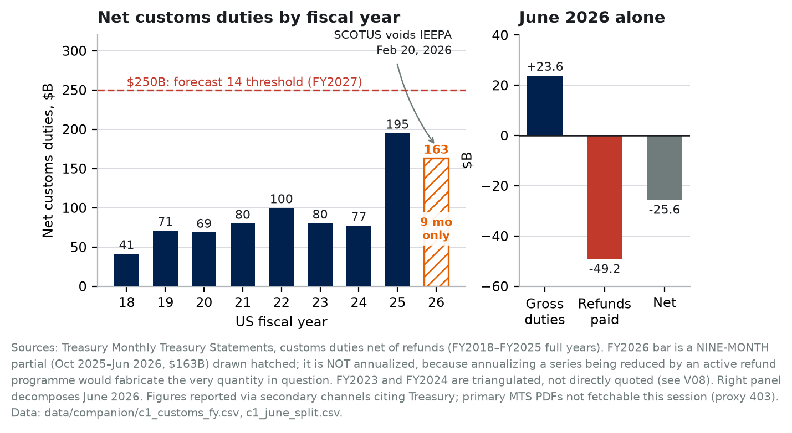
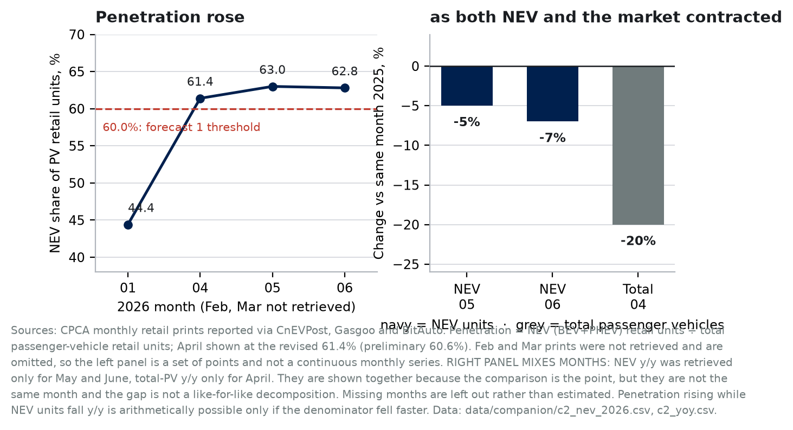
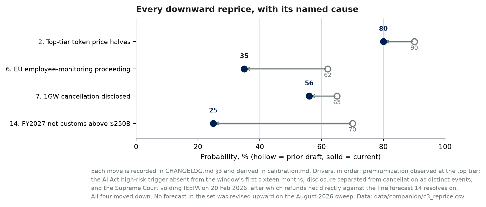

# Research companion

*Supporting evidence, quantitative build-out, and reassessment for "Forecasts on AI and Modern Mercantilism." Built on the August 2026 research sweep recorded in `verification/V11_august_2026_sweep.md`.*

The submission is bound by a 15-page limit. This document is not. It carries the material that would not fit: the additional figures with full provenance, the per-forecast reassessment against evidence published after the July 30–31, 2026 anchors, the counterarguments, and the places where sources disagree.

Nothing here overrides the submission. Where the two differ in emphasis, the submission is the claim and this is the working.

---

## 1. What this session could and could not do

Every figure and every number below inherits one constraint, and a reader should apply it throughout rather than have it repeated in each section.

| Channel | Result this session |
|---|---|
| `curl` direct egress | 403 at CONNECT, every host including a Wikipedia control |
| `WebFetch` | 403 Forbidden, every URL |
| `WebSearch` | Worked |

**No primary document was opened by this session.** Search returns titles, URLs, and server-side summaries of pages. When a figure below is attributed to Treasury, BEA, IFR, IEA, USTR, or a company filing, that attribution reports what the search channel said the primary source contains. It has not been re-derived from the primary source here.

Two independent search results agreeing is the strongest tier available in this environment. It is weaker than reading the document, and the distinction is load-bearing for a paper that stakes its credibility on provenance. This is why nothing in this sweep is marked `primary_confirmed`.

### Evidence tiers

The repository's ledger (`data/figure_sources.csv`) already carries a `status` column, and this document uses the same vocabulary rather than inventing a parallel scheme.

| Tier | Meaning | Ledger status |
|---|---|---|
| Directly established | Multiple independent sources report the same figure | `search_confirmed` |
| Multi-source interpretation | Sources agree on the reading; the figure is derived or characterized rather than printed | `search_confirmed` with transformation noted |
| Derived | Computed here from reported inputs, method stated | `triangulated` |
| Projection | A named party's forward estimate, not an observation | `estimate` |
| Inference | Reasoning by the author from the above | marked in prose, never plotted as data |
| Carried | From an earlier draft, not re-verified | `carried_unverified` |

---

## 2. Figure C1 — The tariff line broke, and the break is legal rather than economic



**Takeaway.** Net customs duties nearly tripled in FY2025 to $194.9B, then stopped being a growth series. In June 2026 the line went negative because refunds ordered after the Supreme Court voided the IEEPA tariffs exceeded gross collections for the month.

**Underlying values.**

| Fiscal year | Net customs duties, $B | Coverage | Status |
|---|---|---|---|
| 2018 | 41.3 | full year | search_confirmed |
| 2019 | 70.8 | full year | search_confirmed |
| 2020 | 68.6 | full year | search_confirmed |
| 2021 | 80.0 | full year | search_confirmed |
| 2022 | 99.9 | full year | search_confirmed |
| 2023 | 80.3 | full year | **triangulated** |
| 2024 | 77.0 | full year | **triangulated** |
| 2025 | 194.9 | full year | search_confirmed |
| 2026 | 163.0 | **9 months only** (Oct 2025–Jun 2026) | search_confirmed |

June 2026 decomposition: gross duties **+$23.6B**, refunds **−$49.2B**, net **−$25.6B**.

**Sources.** Treasury Monthly Treasury Statements (https://fiscaldata.treasury.gov/static-data/published-reports/mts/MonthlyTreasuryStatement_202606.pdf, URL recorded but not fetched). June decomposition via Quartz, "U.S. pays more in tariff refunds in June than it makes in tariff revenue," 2026-07-14 (https://qz.com/us-tariff-refunds-june-customs-deficit-071426). CBO Monthly Budget Review, March 2026 (https://www.cbo.gov/system/files/2026-04/61979-MBR.pdf). Ruling and refund mechanics per V11 §1.

**Limitations, stated plainly.**

- The FY2026 bar covers **nine months and is not annualized.** Annualizing it would require assuming a refund path for Q4 FY2026, which is precisely the unknown the chart exists to display. A partial bar that looks short is honest; a projected bar that looks complete is not.
- FY2023 and FY2024 are **triangulated**, not directly quoted. V08 derived them from a CBO percentage change and an implied FY2024 figure in the FY2025 release. They reproduce to within rounding by two independent routes, which is why they are plotted, but they are the weakest bars in the series.
- The $250B threshold line is the forecast's resolution bar for **FY2027**, a year not shown. It is drawn for reference, not as a comparison to any plotted bar.
- Reported vs estimated: all navy bars are reported actuals. The hatched FY2026 bar is a **reported partial**, not an estimate. No bar in this figure is a projection.

**What it does not show.** The chart cannot separate refunds attributable to the IEEPA ruling from ordinary duty drawback. The June figure is net of everything.

---

## 3. Figure C2 — A rising share with a falling numerator



**Takeaway.** China's NEV retail penetration rose above 60% through H1 2026 while NEV unit sales themselves fell year over year. Penetration climbed because the total market contracted faster than the NEV segment did.

**Underlying values.**

| Month 2026 | Penetration, % | NEV retail units, k |
|---|---|---|
| January | 44.4 | 800 |
| April | 61.4 (revised from 60.6 preliminary) | 883 |
| May | 63.0 (record) | 974 |
| June | 62.8 | 1,037 |

| Series | Month | Change vs same month 2025 |
|---|---|---|
| NEV retail units | May 2026 | −5% |
| NEV retail units | June 2026 | −7% |
| Total passenger-vehicle retail | April 2026 | −20% |

**Sources.** CPCA monthly prints reported via CnEVPost (https://cnevpost.com/2026/05/11/china-apr-2026-nev-retail-sales/, https://cnevpost.com/2026/06/03/china-may-nev-retail-cpca-preliminary/, https://cnevpost.com/2026/07/03/chinas-nev-retail-jun-cpca-preliminary-data/), BitAuto (https://www.bitauto.hk/en/news/10011000968.html), Gasgoo (https://autonews.gasgoo.com/articles/news/passenger-car-sales-declined-year-on-year-and-month-on-month-in-first-two-weeks-of-april-nev-penetration-rate-nears-60-2044726602527580161).

**Limitations, stated plainly.**

- **February and March prints were not retrieved.** The left panel is four points, not a continuous series, and the line connecting them should be read as a guide rather than a trajectory.
- **The right panel mixes months.** NEV year-over-year was retrieved for May and June; total passenger-vehicle year-over-year only for April. They are shown together because the contrast is the analytical point, but −7% and −20% are **not the same month** and their difference is not a like-for-like decomposition. Missing months are omitted rather than filled.
- April is plotted at the revised 61.4%, not the 60.6% preliminary. Both are first-print-era figures; the revision is CPCA's own.
- Reported vs estimated: every value is reported. Nothing in this figure is estimated or projected.

**Competing explanations, neither resolved here.**

1. **ICE collapse.** Internal-combustion demand is falling faster than NEV demand inside a shrinking total market, so the ratio rises mechanically.
2. **Pull-forward.** The full purchase-tax exemption pulled NEV demand into 2025; the 2026 halving (RMB 15,000 cap) depressed the 2026 numerator for reasons unrelated to ICE.

Published retail data cannot separate these. Both are consistent with every number above. The distinction matters because explanation 1 is a demand shock and explanation 2 is a policy artifact, and the paper's thesis about strategic control paying off is better served by neither.

---

## 4. Figure C3 — Every reprice, and what forced it



**Takeaway.** Four forecasts have been repriced across revisions. All four moved down, each for a stated reason, and the largest move was forced by an external legal event rather than by reflection.

**Underlying values.**

| # | Forecast | Prior | Current | Driver |
|---|---|---|---|---|
| 2 | Top-tier token price halves | 90% | 80% | Premiumization observed at the top tier |
| 6 | EU employee-monitoring proceeding | 62% | 35% | AI Act trigger absent from the window's first 16 months |
| 7 | 1 GW cancellation disclosed | 65% | 56% | Disclosure separated from cancellation as distinct events |
| 14 | FY2027 net customs above $250B | 70% | **25%** | SCOTUS voided IEEPA; refunds net against the resolution line |

**Sources.** Each move is recorded in `CHANGELOG.md` §3 and derived in `calibration.md`. Forecast 14's reprice is derived in §5 below and evidenced in V11 §§1–3.

**Limitations.** This chart is about the paper's own conduct, not about the world. It shows that repricing happened and why; it says nothing about whether the current values are correct. A set of forecasts that only ever moves down may indicate initial overconfidence rather than good discipline, and that reading is available to a hostile reader. It is fair.

**Reported vs estimated:** all values are the paper's own stated probabilities. No external data.

---

## 5. Forecast 14, repriced 70% → 25%

The one forecast this sweep moved. The derivation belongs here rather than in the submission, where only the conclusion fits.

**What the prior 70% assumed.** FY2025 net customs duties printed $194.9B. The threshold is $250B in FY2027. The prior reasoning was that the series had risen $118B in a single year, that $55B more over two years was a modest ask, and that the failure mode was refund litigation, discounted but not treated as regime-ending.

**What changed.** The Supreme Court held on February 20, 2026 that IEEPA does not authorize tariffs, and the holding was retroactive to inception rather than prospective. That is not a discount to the growth path; it removes the statutory basis for most of what produced the FY2025 figure.

**The four inputs to the new number.**

1. **Refunds subtract from the resolution line.** Forecast 14 resolves on *net* customs duties. The CIT ordered ~$165B refunded, with interest, in stages. June 2026 already printed −$25.6B net. Any refund still flowing in FY2027 comes straight off the number.
2. **Replacement is partial.** CRFB, 2026-07-23: Section 301 and 338 together restore **under 60%** of lost IEEPA revenue, and post-January-2025 tariff actions score roughly **$825B below** CBO's February 2026 baseline through FY2036.
3. **Replacement is contested.** Section 122, the February bridge, was ruled illegal by the CIT pending appeal. Challenges to the 301 and 338 actions are anticipated.
4. **The base is large.** Section 301 covers roughly **$949B** of 2026 imports at 10–12.5%.

**The arithmetic, stated as a decomposition rather than a point estimate.** A $250B net print in FY2027 requires roughly: gross collections under successor authorities exceeding the IEEPA-era gross run rate, *minus* whatever refund tail remains. Input 4 makes the gross plausible in principle; a $949B base at 12.5% is over $118B before considering pre-existing Section 232 and 301 lines. Inputs 1 through 3 make the net and the durability doubtful.

**P(YES) ≈ P(successor regime survives challenge through FY2027) × P(gross clears ~$250B plus residual refunds | survival).** I assign roughly 0.55 to the first and roughly 0.45 to the second, giving ~0.25. Both are judgment, not derived from a reference class, and I say so: there is no prior instance of a tariff regime of this size being voided and reconstituted under different authorities within two years, so the reference class is empty.

**What would move it back up.** Congressional ratification by statute would largely settle input 3 and would justify a substantial upward revision. Appellate reversal of the Section 122 ruling would do less, since Section 122 is time-limited by design.

**What would move it down further.** An adverse ruling on the Section 301 forced-labor actions, or a refund schedule that extends materially into FY2027.

---

## 6. Reassessment of every other forecast

Ordered by how much the evidence moved. Full sourcing in V11 at the section noted.

### Materially strengthened, no reprice

**Forecast 7 (56%, 1 GW disclosed) — V11 §8.** SemiAnalysis reports Microsoft froze **1.5 GW** of near-term self-build and let **more than a gigawatt** of agreements lapse. That is past the capacity threshold and short of the disclosure requirement, which Table 2 excludes third-party reporting from satisfying. The forecast's two-stage structure predicted exactly this configuration.

*Counterargument, given its weight:* several sources read the same events as **reallocation rather than retreat**. Microsoft leased $11.1B of capacity in Q1 2026; Meta's CoreWeave commitments reached ~$35B; aggregate 2026 capex rose 77%. On the aggregate question the reallocation reading is better supported. Forecast 7 does not depend on the aggregate question, and both readings can hold at once.

**Forecast 15 (40%, world-model synthetic data) — V11 §15.** NVIDIA enrolled ABB, KUKA, Universal Robots, Doosan, Boston Dynamics and Figure AI through 2026, adding FANUC, Kawasaki, Yaskawa and 19 others in a July 17 Japan announcement. Every named adopter is a robot maker, an AI company, or a technology/automotive firm. The forecast requires a **non-technology Fortune 500 operator** disclosing use in **its own facilities**. Vendor adoption is now broad and documented; end-user disclosure remains absent. This is the predicted ordering, and the evidentiary basis is far stronger than the submission shows.

**Claim 3 and forecast 9 (30%, workflow-data licensing) — V11 §10.** Meta's CTO confirmed no opt-out for the MCI program; over 1,600 employees petitioned against it; **European employees were excluded because GDPR does not permit the collection**. One firm, one program, running in one jurisdiction and barred in another. The paper argued this claim from statute. The carve-out argues it from behaviour, and it is the closest thing to a natural experiment the claim could get.

**Forecast 5 (68%, China robot share) — V11 §16.** No new IFR data; World Robotics 2026 was not available, consistent with September publication. The 2025 edition stands at 295,000 of 542,076 for 2024, a computed **54.4%**. New supporting detail: Chinese robot makers' **domestic share rose to 57% in 2024 from 47% in 2023**, which supports the diffusion half of the frontier-versus-diffusion contrast. This also **resolves V07's concern** about the "World Robotics 2028" citation: the 2025 edition covers 2024, so the 2028 edition covers 2027, and the citation is correct.

### Mechanism corrected, forecast unchanged

**Forecast 1 (85%, NEV share) — V11 §5, Figure C2.** Directionally better supported than the submission claimed: monthly prints run 61–63% against a >60.0% full-year 2027 bar. The mechanism was wrong, and the submission now says so.

**Forecast 3 (65%, China gasoline) — V11 §6.** The IEA attributes part of the decline to **high pump prices** discouraging ICE driving, not to fleet displacement. The submission now names this rival rather than leaving it implicit. Forecast 3 is the discriminating test between them, so naming it strengthens the framing.

### Context added, no change

**Forecast 11 (30%, depreciation) — V11 §9.** Meta's 4→5.5 year extension cut 2025 depreciation expense by **$2.9B**, a useful quantification of the incentive to delay that the paper asserts. Burry estimates 2026–28 depreciation understated by ~**$176B**, overstating profits by >20%; that is one investor's contested estimate and is labeled as such.

**Forecast 17 (30%, USD/JPY) — V11 §17.** The submission's admitted gap is closed: **159.41** on July 31, 2026; BoJ at **1.0%**, highest since September 1995, after a June hike, held 8–1 in July. The carry compresses from both ends while one estimate still puts the differential at 250–275bp by Q4. Probability unchanged; the reasoning no longer apologizes.

**Forecast 16 (70%, LA28 delivery) — V11 §14.** Reporting indicates **18 of 28 on course**, against a threshold of fewer than 20 open. Consistent with 70% and with little margin. **Caveat:** several counts appear to date from 2024 reporting and it is unclear whether they measure against the original 28 or the March 2024 revised list that governs resolution. Treat as directional only.

**Forecast 12 (38%, Vietnam + Thailand imports) — V11 §2.** The tariff scaffolding changed underneath this forecast without changing its threshold. Vietnam, Cambodia and Thailand sat at a flat 10% Section 122 rate expiring July 24, 2026, with 12.5% Section 301 duties proposed as replacement; Vietnam is in the 12.5% group. **Open item:** Thailand's tier could not be confirmed, and the submission asserts both are at the higher tier. That half-sentence should be treated as `carried_unverified`.

### Criterion fragility identified

**Forecast 10 (20%, LMArena) — V11 §12.** Four labs sat within Elo noise at the top through 2026, with the **#1-to-#10 gap around 28 points** and sub-10-point differences inside noise. Holding **30 consecutive days** at #1 is therefore hard for any lab, which lowers the probability for a Chinese entrant for reasons unrelated to Chinese model quality. The submission stakes this forecast on a frontier-versus-diffusion contrast; the metric is noisier than that framing implies. Worth a sentence in a future revision.

### Unchanged for lack of trustworthy sources

**Forecast 2 (80%, token prices) — V11 §13.** Third-party LLM pricing trackers returned mutually inconsistent and visibly stale figures, including one listing Anthropic's current flagship as "Opus 4.8 as of May 28, 2026" alongside another reporting Claude Fable 5 shipping July 1, 2026. These are exactly the repeat-without-tracing sources the method section rejects. **Nothing changed.** The baseline should be captured directly from provider pricing pages if any session regains egress.

---

## 7. Where the evidence cuts against the paper

Collected here rather than scattered, because a reader deserves them in one place.

**The inflation-floor transmission looks weaker than the paper implies.** The paper derives an inflation floor from a tariff wedge. The wedge began unwinding in February 2026, refunds started flowing in April, and core PCE stayed at or above 3.0% throughout, printing 3.3% in June. Two readings compete. Either inflation persisted while the wedge shrank, in which case tariffs were not the binding driver and the transmission is overstated; or pass-through is slow and partly irreversible, refunds accrue to importers rather than to consumer prices, and replacement tariffs held much of the wedge. **The second is better supported**, since refunds go to importers of record and no consumer-price pass-back appears in the evidence. But the paper's own concession that forecast 13 "establishes co-movement rather than causal attribution" is now doing real work rather than sitting decoratively, and this episode is why.

**The NEV mechanism was misread.** Covered above and now corrected in the submission. Worth restating that the correction was found by checking whether a rising ratio had a rising numerator, which is the kind of check the paper's own method section demands and had not performed here.

**Aggregate capex behaviour contradicts the retreat reading.** 2026 guidance is ~$725B, up 77%, with consensus above $1T for 2027. The delivery-constraint thesis predicts a binding physical limit. That limit has not yet bound in the spending data. Forecasts 7, 8 and 11 are the tests, and none has resolved.

**Four repricings, all downward.** Figure C3 makes this visible deliberately. The generous reading is calibration discipline. The hostile reading is that the initial set was systematically overconfident and is still converging. Both fit the record.

---

## 8. Open items

Ordered by how much they would change.

1. **Digital Omnibus scope (forecast 6).** One source states full AI Act high-risk enforcement applies from **August 2, 2026**; the submission states the Omnibus deferred workplace-AI high-risk obligations to **December 2, 2027**. These cannot both be right about workplace AI. The likeliest reconciliation is that August 2026 is the general high-risk date while the Omnibus carved out specific Annex III employment categories. **This session could not obtain the Omnibus text.** Forecast 6 was cut from 62% to 35% precisely because the AI Act trigger was thought absent from the window's first sixteen months. If the deferral does not cover workplace AI, forecast 6 is underpriced, plausibly into the mid-40s given the thickening enforcement record (EDPB Guidelines 03/2026 on 2026-07-08; four national authorities active against AI firms; joint GDPR/AI Act theories since the €535M TikTok decision of November 2025). **Highest-priority unresolved item.**
2. **Thailand's Section 301 tier (forecast 12).** The submission asserts Vietnam and Thailand are both at 12.5%. Only Vietnam is confirmed.
3. **Forecast 2 baseline capture.** Still blocked, still `snapshot_secondary_only`.
4. **LA Metro count basis (forecast 16).** Whether the 18-of-28 figure measures against the original or the March 2024 revised list.
5. **Company-level capex on a common basis (forecast 8).** V06's boundary work needs filings this session could not fetch. The $725B aggregate is usable; the company splits are not.

---

## 9. Reproducing this document's figures

```
python3 companion_figures.py     # -> figs/companion/*.png and *.svg
```

Deterministic and offline, same discipline as `figures.py`: bundled fonts only, every value read from a CSV under `data/companion/`, nothing interpolated. The three datasets are `c1_customs_fy.csv` with `c1_june_split.csv`, `c2_nev_2026.csv` with `c2_yoy.csv`, and `c3_reprice.csv`.

Palette semantics are inherited from the submission's figure spec: navy for observed data, slate for comparison series, orange for projections, estimates and partial periods, red dashed for forecast thresholds only.
