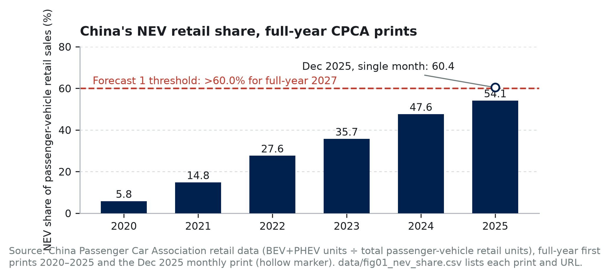
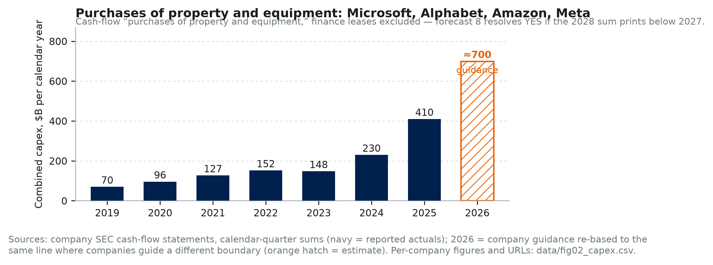
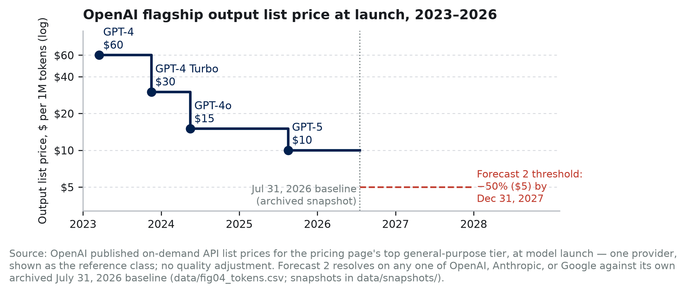

# Control Without Feedback: Forecasts on AI and Modern Mercantilism

*Modern mercantilism suppresses price signals in exchange for control of strategic inputs. AI reprices sensing and codified output. The fourteen forecasts below are one claim priced fourteen ways: the decade belongs to systems that take control without losing error correction.*

# Part 1: One Claim, Priced Fourteen Ways

Each probability starts from a reference class or market-implied prior, measures the distance from the current state to the threshold, and adjusts for named drivers; Part 3 shows the machinery, including one derivation worked end to end. Resolution mechanics — sources of record, vintage rules, tie-breaks, fallbacks — are in Table 2.

**1. 85% — More than 60.0% of the passenger vehicles China sells at retail in calendar 2027 are new-energy vehicles, resolving YES if the CPCA's first full-year 2027 print puts the NEV share of retail sales strictly above 60.0%.**

**2. 80% — The published on-demand output-token price of the most capable generally available model from at least one of OpenAI, Anthropic, or Google ends 2027 at least 50% below that provider's July 31, 2026 level, on archived pricing pages under the pre-registered selection rule in Table 2.**

**3. 65% — China's average gasoline demand for calendar 2027 prints below its calendar-2026 average in the first IEA Oil Market Report carrying a complete 2027 figure.**

**4. 70% — MP Materials is still named on China's MOFCOM export-control list on December 31, 2027.**

**5. 68% — China accounts for more than 54.0% of global industrial robot installations in calendar 2027, as reported in the first print of the IFR's World Robotics 2028 edition.**

**6. 35% — Before the end of 2028, an EU or member-state authority opens a formal proceeding against at least one of Meta, Microsoft, Alphabet, Amazon, OpenAI, or Anthropic specifically concerning employee-monitoring data used for AI training.**

**7. 56% — Before the end of 2028, at least one of Microsoft, Alphabet, Amazon, Meta, or Oracle itself publicly discloses cancelling or indefinitely deferring at least 1 GW of previously announced US datacenter capacity.**

**8. 30% — Combined calendar-2028 purchases of property and equipment by Microsoft, Alphabet, Amazon, and Meta print below the combined calendar-2027 figure in first-print SEC filings.**

**9. 30% — Before the end of 2030, a Fortune 500 company outside the Technology and Media sectors announces an executed agreement licensing its employees' workflow data — screen recordings, keystroke-level logs, or software-interaction traces — for model training to OpenAI, Anthropic, Google, Meta, xAI, or Microsoft.**

**10. 20% — A model from a China-headquartered lab holds the #1 position on the LMArena overall text leaderboard for at least 30 consecutive days before the end of 2027, on daily archived snapshots.**

**11. 30% — At least two of Microsoft, Alphabet, Meta, and Oracle disclose a reduction in the stated useful life of server or network equipment in annual reports filed before March 31, 2029.**

**12. 38% — Combined US goods imports from Vietnam and Thailand in calendar 2028 print below their combined calendar-2026 level in the Census Bureau's first-print FT-900 annual data.**

**13. 55% — US core PCE inflation prints at or above 3.0% year over year in at least six of the twelve months of calendar 2027, on BEA first prints.**

**14. 70% — Net customs duties collected by the US government in fiscal year 2027 exceed $250 billion in the September 2027 Monthly Treasury Statement, first print.**

---

# Part 2: Framework

*Modern mercantilism trades the price mechanism for control of strategic inputs. AI collapses the cost of sensing and the price of codified output. What decides the decade is which systems take control while keeping their error correction intact.*

Modern mercantilism is economic policy that treats trade and technology as instruments of state power rather than as markets to be left efficient. Governments deliberately override prices — through tariffs, subsidies, export controls, and directed procurement — to secure control of inputs they define as strategic. Institutions of every kind run a feedback loop: sense conditions, store what happened, predict, act, sense the results. Mercantilist policy dulls the loop's strongest signal, relative prices, in exchange for that control. AI enters because it reprices the loop's first stage: telemetry and measurement become cheap, and some older signals go obsolete.

What separates outcomes is whether error correction survives once prices are suppressed. We use the term operationally, not as metaphor. A system keeps its error correction if, when a delivery or demand signal moves against a standing commitment, some institution's recorded behavior — supply, accounting recognition, docketed enforcement, a published revision — adjusts in the same direction within about twenty-four months. Several forecasts are direct measurements of that elasticity: forecast 11 asks whether depreciation schedules respond to hardware turnover inside the window, forecasts 7 and 8 whether capex responds to the grid, and forecast 3 whether a demand response survives after the price signal that produced it has normalized. Winners direct capital while preserving contestation. Losers achieve command and lose the ability to detect that they are wrong.

| Framework claim | Priced by | Where we differ most from consensus |
|---|---|---|
| The return on strategic control arrives in crises, as optionality | 1, 3, 4, 12, 14 | Post-shock consensus has oil demand recovering at lower prices; we bet China's gasoline line does not participate (3) |
| The binding constraint has moved from capital to physical delivery | 7, 8, 11 | No published estimate we can find models a 2028 hyperscaler capex contraction; we hold 30% (8) |
| Workflow data is the new chokepoint, and employment law sets its accumulation rate | 6, 9 | Data marketplaces get predicted constantly; we put 70% on the moat outcome (9) |
| When codified knowledge gets cheap, value migrates to what stays scarce | 2, 5, 10 | China loses the frontier scoreboard while winning the diffusion scoreboard (10 and 5 as a pair) |
| The chain ends in an inflation floor | 13, 14 | Consensus has the 2026 shock washing out and core returning toward 2%; we price the floor holding (13) |

**1. The return on mercantilism arrives during crises, as optionality.** The standard scoreboard for industrial policy — market share, trade balances — measures the wrong output. The return on strategic control is invisible most of the time and pays during crises. China's EV program is the worked example. A policy sold as auto-sector competitiveness turned out to be energy security. By the time the Hormuz disruption hit this spring, the electric fleet had displaced roughly a million barrels a day of oil demand (Kpler estimates ≈540 kb/d of gasoline and ≈500 kb/d of diesel in 2026). That floor let China pull about four million barrels a day out of normal purchasing — crude imports down roughly 40% on IEA accounting — while cutting refinery runs and curtailing product exports, as Brent round-tripped from above $113 to under $70. Demand elasticity was the shock absorber, and it had been built years earlier at subsidized cost. Forecasts 1 and 3 are the continuation bets: the transition now runs on halved purchase incentives — CPCA monthly prints have held above 60% since April 2026 — and the oil-demand break holds through the post-shock rebound.

The comparison cases run the same loop with worse error correction. ASEAN's China+1 buildout was funded by a tariff arbitrage that the July Section 301 action compresses (forecast 12). One observation discriminates: Thailand, at a fraction of Japan's income per head, put battery-electrics at 19.4% of new-car sales in 2025 (FTI data), most of them Chinese brands; Japan, several times richer, sat below 3% even counting plug-in hybrids. Income predicts the opposite of what happened; policy-priced access to Chinese models predicts it exactly — and when Japanese adoption jumped in early 2026, a raised purchase subsidy is what moved it.

**2. The binding constraint has moved from capital to physical delivery.** Money is not scarce; transformers, interconnection queues, skilled trades, and permitting throughput are. Hold the roughly $700 billion of calendar-2026 capex guided by Microsoft, Alphabet, Amazon, and Meta against the grid asked to energize it. Announced and energized capacity have decoupled, and the recognition of the gap is itself forecastable. Forecast 7 prices a disclosed gigawatt-scale cancellation, forecast 8 a falling capex print, forecast 11 a shortened server-depreciation schedule — the accounting system's error correction firing in public. Rare earths are the same constraint one level down: Beijing's export-control listings, with narrow exceptions, currently decide who manufactures the permanent magnets in every humanoid actuator (forecast 4).

**3. Workflow data is the new chokepoint, and employment law now sets its accumulation rate.** The scarce input for frontier AI has moved from public text to proprietary workflow data: recordings of how humans actually operate software. That data does not exist on the open internet. It exists inside firms, generated by employees, which makes its accumulation a question of labor and privacy law — and therefore of trade. Nobody is calling it trade policy yet. Meta's Model Capability Initiative is the test case: screen content and keystroke-level activity captured from US employees, paused this June after a security review. Meta has confirmed the program, the absence of a broad opt-out, and the pause; press reporting citing an internal security notice put the exposed corpus at roughly 45,000 internal tables, which Meta has not confirmed. A pause is not a cancellation — the corpus and the incentive both survive. The US permits this accumulation; the EU largely does not, through GDPR's minimization rules, national workplace-monitoring statutes, and works-council vetoes (Thread 2). So the accumulation rate of the decade's scarce input is set by employment regulation, and Europe may be regulating itself out of the input market while believing it is protecting citizens. We expect enforcement to surface (forecast 6) while the input stays locked inside firms as a moat rather than becoming a traded commodity (forecast 9).

**4. When codified knowledge gets cheap, value migrates to what stays scarce.** The repricing flows toward tacit skill and physical position, and it is visible first in the price of the models' own output (forecast 2, Figure 5): the most codified good in the economy is the one the models sell. That also makes inference demand less sticky than the capex assumes, since routing work across interchangeable models is what you do with a codified good. The same logic explains where automation lands. Consensus says automation follows labor cost; we say it follows labor scarcity. Japan, where the working-age population has shrunk for over a decade, had self-checkout in 77.1% of supermarkets on the Japan Supermarket Association's survey, while Amazon's checkout-free format in the high-wage US market leaned on offshore human reviewers and was pulled from full-size US groceries in 2024. Where labor is abundant, the rational move was to use the humans; where it is disappearing, staff-less formats scale. China's position is a split verdict by design: compute export controls hold it off the frontier leaderboard (forecast 10) while low deployment friction wins it diffusion into physical industry (forecast 5) — it has installed the majority of the world's industrial robots every year since 2021, at manufacturing wages a fraction of US levels.

**5. The macro block follows from the chain.** The chain runs one way: trade instruments move relative prices; repriced inputs redirect investment toward strategic capacity and away from measured efficiency; the investment mix sets the growth-inflation blend; the blend forces the fiscal and monetary response. Forecasts 13 and 14 read two gauges on that chain — the inflation floor the wedge builds, and the tariff wall's own revenue line, which is the most direct observable of whether the wall stays up.

**How we would know we are wrong.** A single miss would not do it; the tests are patterns. If capex compounds through 2028 with energized capacity keeping pace (7, 8, and 11 all NO), the delivery constraint is imaginary. If Chinese gasoline demand rebounds (3 NO) while the EV share stalls (1 NO), the optionality account of mercantilism fails its best case. If a Chinese lab takes and holds the frontier crown while diffusion stalls (10 YES and 5 NO), control and competence travel together and our central distinction is wrong. If a liquid workflow-data market emerges quickly and broadly (9 YES by 2028), the chokepoint framing dies. If core PCE spends most of 2027 below 3.0% (13 NO), the transmission from policy wedge to prices fails at the first link. Any three together would be fatal. The forecast set is deliberately built so the framework can lose.

---

# Part 3: Analytical Appendix

*Derivations where arithmetic carries the argument; resolution mechanics; a self-audit of where we are most likely wrong.*

## Thread 1: China's Oil Position Is Arithmetic, and the Crisis Tested It

The displacement estimate should be shown, not asserted. China's NEV fleet stood at 31.4 million vehicles at end-2024 (Ministry of Public Security registrations), 70.3% battery-electric. Assume a blended 13,000 km per vehicle-year and counterfactual ICE economy of 7.5 L/100km. Battery-electrics then displace 21–22 billion litres of gasoline a year; plug-in hybrids at half electric mileage add roughly 4 billion. That is about 0.45 million barrels a day from passenger cars — an estimate from stated assumptions, marked as such in Figure 3. Kpler's independent estimate — roughly 540 kb/d of gasoline and 500 kb/d of diesel displaced in 2026, across all electrified segments — reaches roughly 1.0 mb/d.

The crisis mechanics matter more than the level. With world supply roughly 10 to 13 million barrels a day below pre-conflict levels on the IEA's monthly accounting (10.1 mb/d in March, 12.8 mb/d in April), China pulled crude imports down about 40% — roughly four million barrels a day out of normal purchasing — while cutting refinery runs and curtailing product exports. Decomposed honestly, the fleet's structural displacement is the smaller share of that swing; refinery cuts and halted exports did the volume, with inventory draws behind both. But each of those levers could be pulled without domestic shortage only because baseline gasoline demand is structurally lower and falling. The fleet did not supply the swing; it was the option that made the swing survivable, bought years earlier at subsidized prices while the trade-balance scoreboard recorded only the cost.

Forecast 3 then asks the sharpest version of the question, as a ratchet: does the decline hold once the price pressure that helped produce it is gone? Gasoline demand is tracking a roughly 5.5% decline this year (GL Consulting via Bloomberg; the same consultancy expected 5.2% before the war), while post-shock outlooks have demand recovering as prices normalize. Any year-over-year rebound in China's line resolves NO, which is why the forecast sits at 65% rather than higher. The same loop with weaker error correction produces the ASEAN fork: the July 23 Section 301 action — sixty economies at 10% or 12.5%, Vietnam and Thailand at the higher tier, with defined product carve-outs (USTR) — compresses the arbitrage that funded China+1, and forecast 12's 38% prices the wall against relocation momentum that has outrun every previous tariff round. If 13 resolves NO while 6 resolves YES, capacity automated in place.

## Thread 2: Workflow Data Is a Chokepoint, and Employment Law Is the Trade Policy

The legal asymmetry is checkable today. In the US, employer monitoring of company equipment is broadly lawful under the business-purpose exception to federal wiretap law. In the EU, three instruments bite before any AI-specific rule: GDPR's minimization and purpose-limitation principles, Italy's Workers' Statute Article 4 and its peers, and works-council codetermination vetoes over monitoring systems. The AI Act adds nothing before December 2027: the Digital Omnibus (Regulation (EU) 2026/1744) deferred the high-risk obligations that would cover workplace AI systems from August 2026 to December 2, 2027. None of this was written as industrial policy. All of it now functions as industrial policy, because it sets the accumulation rate of the input agentic models need most: demonstrations of how humans operate software, which do not exist publicly at scale. Meta's MCI is what accumulation looks like where law permits it — and the pause is an interruption, not a cancellation, because the corpus and the incentive both survive.

Forecast 6 prices the enforcement side of the collision, and the base rate is thin. In eight years of GDPR, exactly one formal proceeding against the six named firms has concerned employee-monitoring data: CNIL against Amazon France Logistique, decided December 2023, with the fine later cut on appeal. Exactly one has concerned AI-training data: the Garante's OpenAI action, annulled on jurisdictional grounds in March 2026. No authority anywhere has combined the two elements in one docket; the nearest analog is the Irish DPC's 2025 inquiry into X over Grok training data, against a firm outside the six. Against that thinness: employee-data cases route to national authorities rather than the Irish bottleneck, the labor channel moves quickly where it moves at all, and the MCI episode raised the salience of exactly this conjunction. The prior draft priced this at 62% on an AI-Act trigger that no longer exists in the window's first sixteen months. Repriced from scratch: 35%. The number is a conjunction — a visible trigger, an authority willing to name the AI-training nexus in its scope, and an opening before the window closes — and the high-risk regime that would widen the channel attaches only in the window's final thirteen months.

Forecast 9, the moat-versus-market question, holds 30% against the recurring prediction of data marketplaces. Arrow's information problem (a buyer cannot value workflow data without inspecting it, and inspection transfers the value), adverse selection (a firm willing to sell its workflow exhaust signals nothing distinctive is in it), and liability (employee personal data cannot be cleanly separated out) all hold the market back; strategic retention closes the loop. The failure mode is visible early if we are wrong: a broker layer that certifies and anonymizes corpora, the way clinical-claims aggregators standardized healthcare data.

## Thread 3: The Macro Block, Derived from First Prints

Anchors as of July 30, 2026, all first prints. Core PCE 3.3% year over year in June, the seventh consecutive print at or above 3.0% (BEA). Policy rate 3.50–3.75%, held a fifth straight meeting on a 9–3 vote with the dissents preferring a hike (FOMC, July 29). The 30-year Treasury above 5.2%, its highest since 2007 (Federal Reserve H.15). Q2 real GDP at a 1.5% annualized rate (BEA advance). Customs duties $194.9 billion net in FY2025; FY2026 collections ran well ahead of that pace before a litigation-driven refund wave turned May 2026 net collections negative (Treasury Monthly Treasury Statements).

**Forecast 13, worked end to end.** Reference class first: since 1985 the revised core-PCE series has crossed durably from above 3.0% to below it only twice — the early-1990s disinflation, which came with a recession, and late 2023, which came as supply shocks unwound. Neither happened while trade policy was actively adding costs. Decompose the event. P(YES) = P(core enters 2027 at or above 3.0%) × P(six qualifying months given that start) + P(enters below) × P(six qualifying months anyway). We put 0.65 on the first condition: seven consecutive prints at or above 3.0%, the last three at 3.3% or higher, with the July Section 301 round still passing through — against a restrictive Fed and a consensus that expects decline. Conditional on entering 2027 at the threshold or above, six qualifying months require only that disinflation not arrive fast and stick: 0.75. Entering below it, re-acceleration to six months is unlikely: 0.15. The arithmetic gives 0.65 × 0.75 + 0.35 × 0.15 ≈ 0.54, printed as 55% — a deliberately small lean against market pricing. Each input, its evidence, and the sensitivity of the output are in calibration.md. Forecast 14 starts from a run rate clearing its threshold with headroom and discounts for the demonstrated failure mode: litigation-driven refunds, which turned May 2026 net collections negative. 70% prices entrenchment over reversal.

## Shorter Derivations

**Forecast 2 (token prices).** The reference class cuts both ways. OpenAI's flagship launch price fell $60 → $30 → $15 → $10 in twenty-nine months, and two of those steps cleared 50% inside seventeen months. But the top of the market has since re-priced upward: the archived July 31, 2026 baseline records OpenAI's designated top tier (GPT-5.6 Sol) at $30 output, with July's price cuts landing on lower tiers only (Figure 5). The forecast needs any one of three providers to cut its top-tier price 50% against its own archived baseline in seventeen months — a window that will contain next-generation launches from all three, and earlier successors launched at or below predecessor prices, though the most recent did not. Three shots on goal and falling hardware costs, against demonstrated top-tier premiumization: 80%, revised from the draft's 90%. The selection rule is pre-registered here, before the window opens, because "most capable" turns ambiguous the moment providers add premium tiers: the model counted is the one each provider's own pricing page designates as its top general-purpose tier on the baseline date; where a page designates none, the highest-priced generally available text model on it; successors and renames inherit the slot; separately branded premium tiers count only if the page itself designates them top tier. Per-provider baselines and snapshots are archived alongside the data.

**Forecast 5 (robots).** IFR World Robotics 2024 puts China at 276,288 of 541,302 global installations in 2023, or 51.0%; the 2025 edition puts 2024 at 295,000 of 542,076 — a computed 54.4%, which the IFR's own prose rounds to 54%. The share has risen from about 27% in 2015 to a majority every year since 2021. The threshold asks the trend to hold roughly flat, and 68% prices a real chance of a Chinese capex air-pocket rather than doubt about direction. If the IFR discontinues the series, the forecast is unresolved — we do not substitute MIIT China data over a stale world denominator.

**Forecasts 7 and 8 (the delivery pair).** Forecast 7 is two probabilities multiplied, derived separately. First, that at least one of five companies cancels or indefinitely defers a gigawatt of announced US capacity by end-2028: 0.80 — five companies, twenty-nine months, and announced pipelines that outrun any credible energization schedule. Second, that the company itself quantifies it on the record, given that it happened: 0.70. Impairments and contract exits force filings eventually, and earnings-call transcripts count under the criterion; but the most prominent pullback episode to date — the 2025–26 analyst reports of Microsoft lease cancellations — produced analyst capacity figures and a corporate clarification, never a company-quantified number, which is direct evidence this stage sits below where an efficient-disclosure assumption would put it. The product is 56%, replacing the draft's 65%, which had priced the disclosure event as if it were the cancellation event. Forecast 8 is the trailing confirmation: an actual year-over-year contraction of the four-company capex sum, priced at 30%; we could locate no published sell-side estimate modeling a contraction, and if we believe forecasts 7 and 11 at all, conditional coherence forces this number well above the weight that distribution implies. The reference class for late-then-sudden recognition is the 2000–02 telecom buildout, where US carrier capex fell roughly half from peak within three years.

**Forecast 11 (depreciation).** The recent history runs one way — extensions — until the first reversal (Table 1). The income sensitivity is mechanical: on $100 billion of gross server assets, moving straight-line depreciation from six years to four adds roughly $8 billion of annual expense, which is why we require two companies, exclude Amazon (already resolved), and still price only 30%: the incentive to delay recognition is enormous, and the accounting rules allow delay far longer than the economics deserve.

**Table 1. Stated useful lives of server and network equipment** (company filings and earnings disclosures; the changes forecast 11 prices).

| Company | Change | Effective | Equipment class | Old → new stated life |
|---|---|---|---|---|
| Microsoft | Extension | FY2023 (announced July 2022) | Servers and network equipment | 4 → 6 years |
| Alphabet | Extension | January 2023 | Servers; network equipment | 4 → 6 years; 5 → 6 years |
| Amazon | Extension | January 2024 | Servers | 5 → 6 years |
| Meta | Extension | January 2025 | Servers and network equipment | To 5.5 years |
| Amazon | **Reduction** | January 2025 | Subset of servers and network equipment | 6 → 5 years; plus a separate $920M Q4-2024 accelerated-depreciation charge on early-retired hardware |

**Forecast 10 (LMArena).** Compute export controls choke the frontier specifically; we expect China to lose this scoreboard while winning diffusion (forecast 5), and the pair is the claim. 20% prices occasional #1 releases against the demanding 30-consecutive-day hold. If LMArena is discontinued, the forecast is unresolved — a different benchmark can reverse the outcome, so none substitutes.

**Table 2. Resolution mechanics.** First prints govern; later revisions are ignored. Successors and renamed entities count throughout. Where no substitute is named, a discontinued series leaves the forecast unresolved rather than silently rebuilt.

| # | Source of record (first print) | Threshold, ties, and fallback |
|---|---|---|
| 1 | CPCA full-year 2027 retail print; no single month resolves it | >60.0%; exactly 60.0% = NO. Fallback: CAAM wholesale, flagged as a different denominator |
| 2 | Archived pricing-page snapshots, July 31 2026 and December 31 2027; standard on-demand output rates only (no batch, cached, or negotiated) | ≥50.0% drop for any one provider against its own baseline; exactly 50.0% = YES. Fallback: provider pricing announcements |
| 3 | First IEA Oil Market Report carrying a complete 2027 Chinese gasoline figure; both years read from that print | Strictly below the 2026 average; tie at reported precision = NO. Fallbacks: JODI-Oil, then S&P Global |
| 4 | MOFCOM's Chinese-language export-control list (Announcement No. 23 of 2026 and successors); point in time | Named = YES. Removal or entity-wide waiver = NO; regime-wide suspension while still listed = YES |
| 5 | First print of IFR World Robotics 2028 (published ~September 2028), China units ÷ world units | >54.0%; exactly 54.0% = NO. If the IFR discontinues the series, unresolved — MIIT data over a stale world denominator is not a substitute |
| 6 | The authority's own confirmation of a docketed investigation or action; the employee-monitoring nexus must appear in its statement of scope | Opening resolves YES permanently; later dismissal or annulment does not flip it. Preliminary inquiries and parliamentary letters do not count |
| 7 | The company's own SEC filing, official transcript, or press release; ≥1 GW across sites named in that disclosure, in the original capacity terms | Analyst or third-party reporting of lease non-renewals does not count |
| 8 | Sum of "purchases of property and equipment" cash-flow lines, four calendar quarters; Microsoft re-cut to calendar quarters; finance leases excluded | Strictly below 2027; tie at reported million = NO. Migration into JVs or vendor financing lowers the line and is accepted — it is itself the retreat being forecast |
| 9 | Executed agreement disclosed by either party in a press release or securities filing; workflow data must be named in it; Fortune's sector labels at announcement govern | Pilots and letters of intent do not count |
| 10 | LMArena public overall text leaderboard, daily archived snapshots; tie at top score counts | ≥30 consecutive days at #1. If LMArena is discontinued, unresolved — a different benchmark can reverse the outcome |
| 11 | Useful-life range in each company's property-and-equipment policy note against the prior year, or a disclosed change in estimate naming an equipment class | Two distinct companies; one = NO. Amazon excluded (already reduced, January 2025) |
| 12 | Census Bureau FT-900 annual totals, customs basis, goods only | Strictly below combined 2026; tie = NO. Fallback: BEA goods-imports detail. Tariff front-running likely inflated the 2026 baseline, favouring YES; noted, not adjusted for |
| 13 | BEA Personal Income and Outlays, y/y core PCE as first published for each 2027 reference month | ≥6 qualifying months; exactly 3.0% qualifies. A slipped calendar does not change which print governs |
| 14 | Customs Duties net of refunds, fiscal-year-to-date column, September 2027 Monthly Treasury Statement | >$250.0 billion. Fallback: Treasury's combined annual statement of receipts, same line |

## Sources and Method

Every plotted point and quoted figure traces to a row in `data/figure_sources.csv`, which carries the full URL, access date, vintage, transformation, and verification channel for each. Per-claim verification records, including what each source does and does not establish, are in `verification/`. Principal sources by forecast:

**1, 12** — CPCA monthly and annual retail prints (via CnEVPost and Chinese-language coverage of the releases); State Council Information Office on 2026 purchase-tax and trade-in policy; Federation of Thai Industries (Thailand); JATO (Japan); Census Bureau FT-900. **2** — provider pricing pages snapshotted July 31, 2026 (`data/snapshots/`); OpenAI launch announcements for the historical series. **3** — IEA *Oil Market Report*, March–May 2026, and the IEA's Strait of Hormuz supply commentary; Kpler displacement estimates; China Ministry of Public Security registrations; GL Consulting via Bloomberg. **4** — MOFCOM Announcement No. 23 of 2026 (June 22, the listing) and Announcement No. 26 of 2026 (effective July 1, the separate reporting-reward instrument). **5** — IFR *World Robotics* press releases, 2024 and 2025 editions. **6** — Regulation (EU) 2026/1744 (Digital Omnibus, in force July 27, 2026); CNIL v. Amazon France Logistique and its reduction on appeal; Hamburg DPA v. H&M (2020); Bundesarbeitsgericht 2 AZR 681/16; Meta's own MCI statements, with press reporting flagged as the sole source for the corpus-exposure figures. **7, 8, 11** — company SEC filings and earnings releases (Amazon's 2024 10-K for the useful-life reduction and the $920M charge; Microsoft's FY2023 10-K for the six-year extension; Alphabet and Meta extension disclosures; Meta Q2 2026 for guidance), plus analyst reports of lease cancellations, cited only as the counter-evidence they are. **13, 14** — BEA *Personal Income and Outlays* monthly first prints and the Q2 2026 advance GDP estimate; FOMC statement and implementation note, July 29, 2026; Treasury *Monthly Treasury Statements*; USTR Section 301 notice of July 23, 2026.

**Method.** First prints govern every resolution and every plotted series; where a reference class uses revised historical data, the text says so. Values described as approximate are drawn as estimates. No interpolation of missing observations (the October 2025 PCE gap is drawn as a gap). Every plotted point traces to a row in `data/figure_sources.csv` with source, vintage, URL, and access date; pricing-page baselines for forecast 2 are archived snapshots taken July 31, 2026.

## Self-Audit

**Most likely to be wrong.** (1) Forecast 8: the constraint can be real and the contraction still land in 2029, making us wrong on timing while right on mechanism — and the forecast scores the timing. (2) Forecast 3: post-shock price normalization could induce enough extra driving across the remaining ICE fleet to outpace the growing fleet's displacement for a single year; that would be a timing loss on the mechanism we most believe in. (3) Forecast 6: the enforcement base rate is thin, and we are extrapolating from adjacent enforcement records rather than direct precedent.

**Hardest to defend against a hostile expert.** (1) The moat call in forecast 9: the adverse-selection argument is theory with thin direct evidence, and functioning data markets (ad, credit, healthcare claims) formed once brokers standardized the asset. (2) Automation-follows-scarcity: a development economist can cite Vietnamese and Thai factories automating for quality and FDI reasons; our counter is that China installs a majority of the world's robots at wages a fraction of US levels while its working-age population shrinks — if cost were the driver, the robots would go where labor is expensive. (3) Europe regulating itself out of the input market: the reply that Europe rents frontier capability is partly right, and our rebuttal depends on process-specificity of agentic competence, an unsettled empirical question.

**Conviction lines.** The position we most want to defend live: the optionality reading of China's EV-oil position, because the derivation is arithmetic and the crisis behavior is on the record. The one we least want to defend: forecast 8, a timing bet against the deepest-pocketed capex programs in history.
